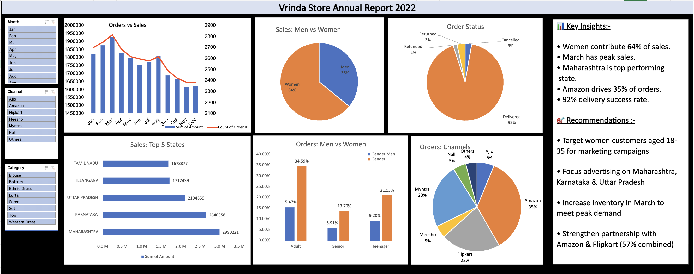

# Vrinda-Store-Analysis
Excel Data Analysis and Dashboard — Vrinda Store Sales 2022
📌 Project Overview
An Excel-based data analysis project analyzing Vrinda Store's sales data for 2022.
Includes data cleaning, pivot tables, charts and an interactive dashboard.

 🎯 Objectives
- Analyze sales trends across months
- Compare sales by gender and age group
- Identify top performing states and channels
- Find peak sales periods

  📊 Key Insights
- Women contribute ~65% of total sales
- Maharashtra, Karnataka and Uttar Pradesh are top 3 states
- Amazon, Flipkart and Myntra are top sales channels
- March and April are peak sales months
- Adult women (30-49 age group) are biggest buyers

  🛠️ Tools Used
- Microsoft Excel
- LibreOffice (for secondary axis charts)
- Pivot Tables
- Slicers and Dashboard

  ⚠️ Known Limitations
- Monthly sales slicer has a known limitation in Excel for Web — this is a platform constraint not an analytical error
- Secondary axis chart created in LibreOffice due to Excel for Web constraints

  📁 Files
- `Vrinda_Store_Data_Analysis_final.xlsx` — Main analysis file with dashboard

  🎓 About
- **Author:** Bushra Sadaf
- **Certification:** IBM Data Analyst Certificate | Business Associate certificate by Unnati
- **Skills:** Excel, Pivot Tables, Data Cleaning, Dashboard Creation, Python(Pandas, Matplotlib, Dash)

  📋 Data Privacy
All data used in this project is sample retail data for educational purposes only.
